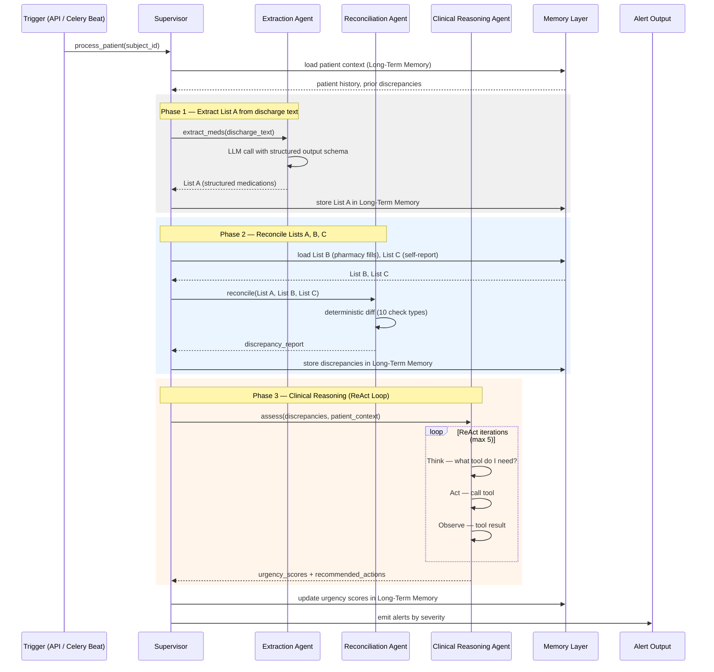

# MedBridge

**AI-powered post-discharge medication reconciliation**

MedBridge detects medication discrepancies between hospital discharge instructions, pharmacy dispensing records, and patient self-reports — then prioritizes them by clinical urgency so care teams know exactly who to call back and why.

---

## Table of Contents

- [The Problem](#the-problem)
- [Solution Overview](#solution-overview)
- [System Architecture](#system-architecture)
- [Agent Pipeline](#agent-pipeline)
- [Data Models](#data-models)
- [Memory Architecture](#memory-architecture)
- [LLM Infrastructure](#llm-infrastructure)
- [Getting Started](#getting-started)
- [CLI Reference](#cli-reference)
- [Configuration](#configuration)
- [Roadmap](#roadmap)

---

## The Problem

Medication errors at care transitions are among the most preventable causes of hospital readmission. When a patient is discharged:

- The **discharge note** lists what medications the patient *should* take.
- The **pharmacy fill record** shows what was actually *dispensed*.
- The **patient's self-report** reveals what they *believe* they are taking.

These three lists rarely match perfectly. Doses change, drugs get substituted for generics, high-risk medications go unfilled for days, or patients simply forget a drug exists. Without a system to surface these gaps, care teams are left doing manual chart reviews — slow, error-prone, and unscalable.

**MedBridge automates the entire reconciliation workflow end-to-end.**

---

## Solution Overview

MedBridge ingests structured (CSV) and unstructured (free-text) clinical data through a multi-agent pipeline:

1. **Extract** — An LLM parses free-text discharge summaries and structures every medication into a canonical schema (name, dose, route, frequency, RxNorm).
2. **Reconcile** — A deterministic engine cross-references the extracted discharge list against pharmacy claims and patient self-report, flagging every meaningful discrepancy.
3. **Triage** — An LLM-powered reasoning agent uses clinical guidelines, drug risk databases, and historical cohort outcomes to assign a 0–10 urgency score and a recommended action for each discrepancy.

The system is built to be provider-agnostic (Ollama today, any OpenAI-compatible endpoint tomorrow), fully configurable through `.env`, and designed with a clear upgrade path toward streaming EHR ingestion (Kafka/CDC) and richer knowledge sources (ChromaDB, PySpark).

---

## System Architecture



---

## Agent Pipeline

The `Supervisor` orchestrates five sequential phases, passing state through Redis:

| Phase | Agent | Method | Output |
|-------|-------|--------|--------|
| 1 | `ExtractionAgent` | LLM (JSON mode) on discharge note | List A — discharge medications |
| 2 | `CSVLoader` + `Normalizer` | Pandas query for pharmacy fills ±3 days post-discharge | List B — pharmacy claims |
| 3 | External write | Patient interview / chat interface (future) | List C — self-reported medications |
| 4 | `ReconciliationAgent` | Deterministic 3-list comparison (10 check types) | `List[Discrepancy]` |
| 5 | `ClinicalReasoningAgent` | LLM ReAct loop with 7 callable tools | `List[UrgencyScore]` |

### Extraction Agent

Uses a two-step approach to handle the variability of real clinical notes:

1. **Regex section extraction** — `parse_discharge.extract_section()` uses pattern lists to locate the "Discharge Medications" block (with fallback to "Medications on Admission").
2. **Structured LLM extraction** — Sends the extracted section to Ollama in `json_mode=True`. The model returns `{"medications": [...]}` which is then parsed into `CanonicalMedication` objects with dose normalization and frequency enum mapping.

### Reconciliation Agent

Fully deterministic — no LLM involved. Medication matching uses `CanonicalMedication.to_key()`:
- If `rxnorm_code` is present → `rxnorm:{code}` (exact code match)
- Otherwise → `name:{normalized_name}` (lowercased, stripped)

Ten discrepancy types are evaluated for every unique drug key found across any list.

### Clinical Reasoning Agent

Uses **native LLM tool calling** via a `ReActEngine`. Each discrepancy triggers a multi-turn conversation where the model decides which tools to call, receives structured observations, and ultimately must call `submit_assessment()` to finalize a score. The engine sanitizes tool arguments to handle LLM hallucinations (phantom arguments, schema-dict values instead of scalars).

---

## Data Models

All medication data is normalized into a single canonical schema regardless of source:

```
CanonicalMedication
├─ rxnorm_code       str | None        # Primary matching key
├─ ndc               str | None        # Pharmacy identifier
├─ drug_name         str               # Raw name
├─ drug_name_normalized str            # Lowercased, stripped
├─ dose              str | None        # "40 mg"
├─ dose_value        float | None      # 40.0
├─ dose_unit         str | None        # "mg"
├─ dose_form         DoseForm enum     # TABLET, CAPSULE, SOLUTION, …
├─ route             str | None        # "PO", "IV", …
├─ frequency         Frequency enum    # DAILY, BID, TID, QHS, PRN, …
├─ quantity          float | None
├─ source            MedSource enum    # DISCHARGE, PHARMACY, SELF_REPORT
├─ date              datetime | None
├─ subject_id        str | None
└─ confidence        float             # 0.0–1.0
```

Discrepancies capture full context from each list — which lists the drug appears in, dose/frequency per list, fill dates, gap days — so the Clinical Agent receives rich structured input for reasoning.

---

## Memory Architecture

| Store | Backend | TTL | Purpose |
|-------|---------|-----|---------|
| Long-term | Redis (JSON strings) | 90 days | Medication lists, discrepancies per patient |
| Short-term | Redis | 7 days | Working memory (planned) |
| Run context | Redis | 30 days | Per-run traceability (planned) |
| Episodic cache | Redis | 24 hours | Hot cohort queries (planned) |
| Semantic | ChromaDB | — | Clinical guidelines vector search (v2) |
| Episodic/Cohort | PySpark | — | Large-scale patient outcome queries (v3) |

The `LongTermMemory` class wraps Redis with typed domain methods (`store_discharge_meds`, `get_pharmacy_meds`, etc.) and handles all serialization/deserialization to `CanonicalMedication` objects.

---

## LLM Infrastructure

MedBridge uses a **router + provider** pattern to decouple agent code from any specific LLM backend:

```
LLMRouter
├─ primary:  OllamaProvider  (default: qwen3.5:4b @ localhost:11434)
└─ fallback: OpenAI-compatible endpoint (vLLM, TGI, LiteLLM, …)
```

The router automatically falls back to the next provider on failure. Switching from Ollama to any hosted API requires only two `.env` changes:

```env
LLM_PRIMARY_PROVIDER=openai_compat
OPENAI_COMPAT_BASE_URL=https://your-endpoint/v1
OPENAI_COMPAT_MODEL=meta-llama/Llama-3.2-3B-Instruct
```

Two LLM call modes are used:
- **JSON mode** (`json_mode=True`) — used by Extraction Agent for structured medication parsing
- **Native tool calling** — used by Clinical Reasoning Agent for the ReAct loop

---

## Getting Started

### Prerequisites

- Python 3.11+
- Redis running on `localhost:6379`
- [Ollama](https://ollama.ai) running locally with `qwen3.5:4b` pulled

```bash
ollama pull qwen3.5:4b
```

### Install

```bash
pip install -r requirements.txt
```

### Configure

Copy `.env.example` to `.env` and adjust paths and model settings:

```bash
cp .env.example .env
```

Key variables:

```env
DISCHARGE_CSV=data/input/discharge_8000.csv
PHARMACY_CSV=data/input/pharmacy_claims_simulated.csv
ANCHOR_CHARTTIME=2024-03-01
OLLAMA_MODEL=qwen3.5:4b
```

### Run

```bash
# Full pipeline for a patient
python main.py supervisor --patient-id 10048001

# Extraction only
python main.py extraction --patient-id 11185694

# Redis memory smoke test
python main.py memory

# Everything
python main.py all
```

---

## CLI Reference

```
python main.py [--log-level LEVEL] <command> [options]

Global options:
  --log-level   DEBUG | INFO | WARNING | ERROR | CRITICAL  (default: INFO)

Commands:
  supervisor    Run the full 5-phase pipeline for one patient
    --patient-id   Subject ID (default: 10048001)
    --charttime    ISO date string (default: ANCHOR_CHARTTIME from config)

  extraction    Run only the LLM extraction agent
    --patient-id   Subject ID (default: 11185694)
    --charttime    ISO date string

  memory        Smoke-test Redis (health check, get/set/delete, med list storage)

  all           Run supervisor + memory check
    --patient-id   Subject ID for the supervisor run
    --charttime    ISO date string
```

---

## Configuration

All settings are Pydantic `BaseSettings` — read from `.env` or environment variables. No prefix required.

| Setting | Default | Description |
|---------|---------|-------------|
| `OLLAMA_MODEL` | `qwen3.5:4b` | LLM model name |
| `OLLAMA_BASE_URL` | `http://localhost:11434` | Ollama endpoint |
| `LLM_PRIMARY_PROVIDER` | `ollama` | `ollama` or `openai_compat` |
| `ANCHOR_CHARTTIME` | `2024-03-01` | Default charttime for queries |
| `ANCHOR_YEAR` | `0` | Years to subtract from dates for de-identification |
| `RECONCILIATION_FILL_GAP_THRESHOLD_DAYS` | `7` | Days before fill gap triggers alert |
| `AGENT_MAX_REACT_ITERATIONS` | `5` | Max tool-calling rounds per discrepancy |
| `ALERT_THRESHOLD_CRITICAL` | `8.0` | Score ≥ this → CRITICAL |
| `ALERT_THRESHOLD_HIGH` | `6.0` | Score ≥ this → HIGH |
| `ALERT_THRESHOLD_MEDIUM` | `4.0` | Score ≥ this → MEDIUM |
| `REDIS_HOST` | `localhost` | Redis host |
| `REDIS_TTL_LONG_TERM` | `7776000` | 90 days in seconds |

---

## Roadmap

### v2
- **RxNorm/NDC-first matching** — match on drug code before falling back to fuzzy name matching; fill in missing RxNorm codes from discharge notes via LLM extraction
- **Tiered matching pipeline** — RxNorm code → Jaccard similarity → drug class → fuzzy string
- **Structured Redis storage** — Redis Hash for medication lists, Ordered Set for discrepancies ranked by urgency, Redis List for chat history
- **Self-reported medication intake** — structured patient chat interface feeding List C
- **SDOH and insurance factors** — incorporate social determinants and coverage gaps into urgency scoring
- **ChromaDB semantic guidelines** — replace in-memory guidelines stub with real vector search over clinical knowledge bases

### v3
- **Streaming EHR ingestion** — CDC (Change Data Capture) + Kafka consumer for real-time discharge and pharmacy notification
- **Run/thread/session persistence** — full audit trail in Redis; resumable pipelines
- **PySpark cohort queries** — replace in-memory cohort stub with distributed patient outcome analytics
- **Comorbidity modeling** — factor active diagnoses into urgency scoring
- **Drug interaction detection** — flag cross-medication side-effect risks
